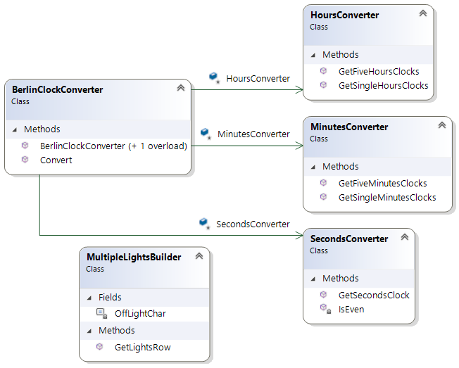
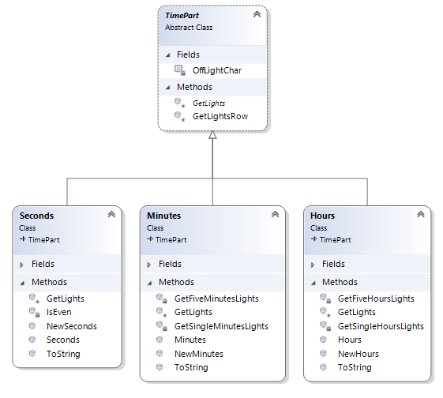

# CodingExercise
Simplified Berlin Clock Kata taken from https://gist.github.com/alfredodev/37d67445b2678e8ef32972517bd7ca96

# Environment Information

## .Net Core BDD Framework
Register `dotnet tool install -g corebdd.commandline` to run tests through the commandline. See more about [CoreBDD](https://github.com/stevenknox/CoreBDD).
The feature spec is automatically generated and follows the typical [gherkin syntax](https://docs.cucumber.io/gherkin/). Running the tests in the command line to view the gherkin syntax

```powershell
corebdd test
```

# Simplified Berlin clock kata

The "Berlin Clock" is the first public clock in the world that tells the time by means of illuminated, coloured fields, for which it entered the Guinness Book of Records upon its installation on 17 June 1975.


The clock is read from the top row to the bottom. 

The top row of four red fields denote five full hours each, alongside the second row, also of four red fields, which denote one full hour each, displaying the hour value in 24-hour format. 
The third row consists of eleven yellow fields, which denote five full minutes each, 
The bottom row has another four yellow fields, which mark one full minute each. 
The round yellow light on top blinks to denote even- (when lit) or odd-numbered (when unlit) seconds.

Example: Two fields are lit in the first row (five hours multiplied by two, i.e. ten hours), but no fields are lit in the second row; therefore the hour value is 10. 
Six fields are lit in the third row (five minutes multiplied by six, i.e. thirty minutes), while the bottom row has one field on (plus one minute). Hence, the lights of the clock altogether tell the time as 10:31. (Source: Wikipedia)

# Task 
Write a function that takes in a particular time as 24h format ('hh:mm:ss') and outputs a string that reproduces the Berlin Clock. The parameters should be as follows:

“O” = Light off
“R” = Red light
“Y” = Yellow light

Example Test Case:
Input String: 
12:56:01

Output String:

O

RROO

RROO

YYYYYYYYYYY

YOOO

## Credits
Based on:
http://agilekatas.co.uk/katas/BerlinClock-Kata
https://www.codewars.com/kata/berlin-clock

# **Solution**

I chose to solve it in two ways for point of discussion. The initial test driven mechanism had all the code within the *BerlinConverter* class. After refactoring, managed to generate a *TimeParts* parser that would be responsible for extracting and  validating the time passed in to the converter. Refactoring the actual converter time parts fairly easy using *Resharper*, however structuring where methods live and how the classes behave was a little trickier. The logic is fairly simple to understand:

| Time part | Light Count | Calculation                                 |
| :-------: | ----------- | ------------------------------------------- |
|   Hours   | 4           | NumberOfLightsOn = hours / (20/4 or 5)      |
|   Hours   | 4           | NumberOfLightsOn= hours mod (20/4 or 5)     |
|  Minutes  | 11          | NumberOfLightsOn= minutes / (55/11 or 5)    |
|  Minutes  | 4           | NumberOfLightsOn = minutes mod (55/11 or 5) |
|  Seconds  | 1           | NumberOfLightsOn = seconds mod 2 ? 1 : 0    |

 

## Procedural solution

Extracting a converter into simple classes was the simplest way to extract the methods out of the overloaded *BerlinConverter* class. So logically I could easily create three converters to represent the hours, minutes and seconds. Once I had three converters, I could extract two common patterns occurring within the hours and minutes into a common class and the rest could be simple methods off of each converter. In the end, this seemed to be the most simple way to refactor code into logical classes.



## Object oriented solution 

This needed a little more thought up front. Extracting the logic time parts was straight forward. The base class had to express the polymorphic nature of each time part in a generic way. So two common things came out of this, each time part would be responsible for turning lights on and off for each row. In the end this seemed to be the most  elegant solution so I left the kata with this solution.

